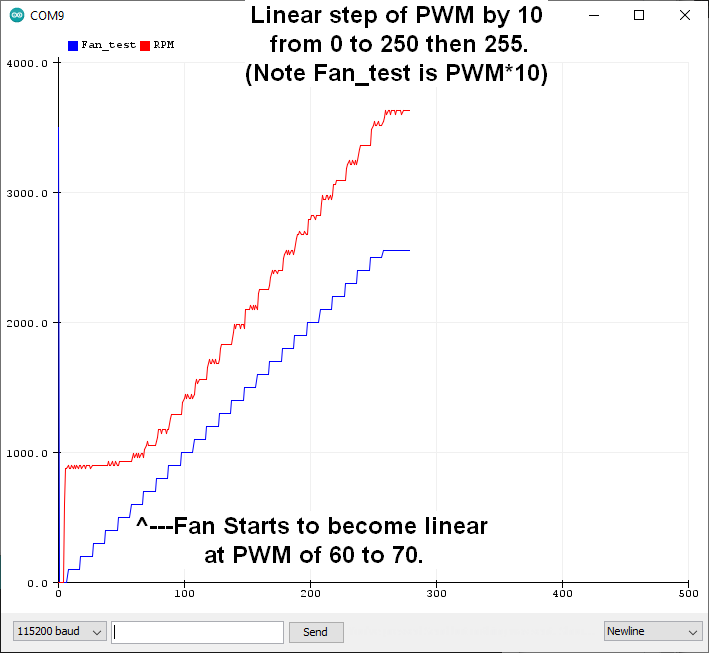
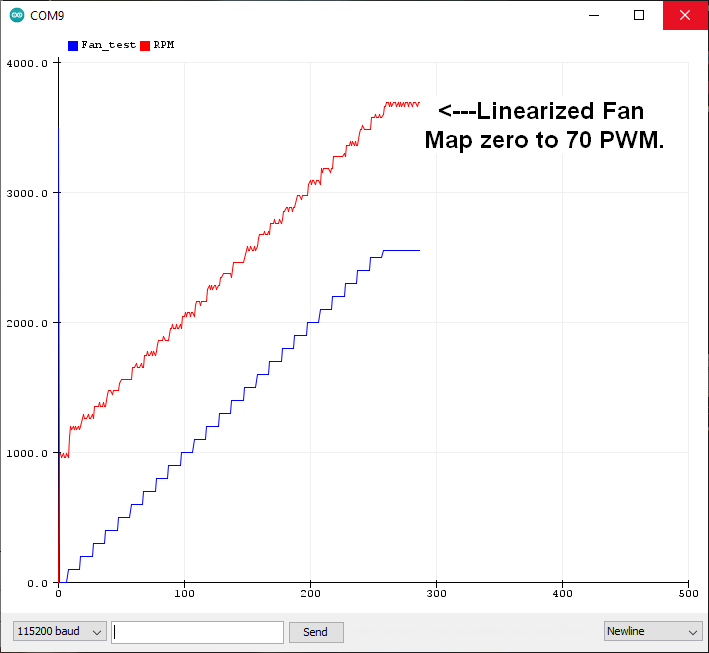

# FanControlLinearized
Linearized control of a PWM fan.  
RPM measured by Frequency Counter using Timers 1 &; 2

## Project Details
The muffin fans used, for example, in Personal Computers can be controlled with a PWM signal but the RPM does not control to zero.
On the low RMP side, there is a range of PWM for which the RPM does not change.
A 92x92 mm square fan was found to have the same RPM (just below about 1000 RPM) for PWM values below about 70 (out of 255).  

**SCREEN SHOT of an uncorrected RPM PLOT**  


This firmware in this repository linearized the fan by mapping a PWM set value input to the serial monitor of 0 to 255 to a reduce range of 70 to 255 into the fan.  
This firmware also inverts the duty cycle because a transistor was used to buffer the GPIO pin output to the fan PWM input.  This is because of reports of fans with a pull up to 6V which would exceed the input voltage on 5V, and certainly 3.3 Volt, controller GPIO pins.

**SCREEN SHOT of LINEARIZED RPM PLOT**  
  
Plot of the linearized Fan RPM verse input. (Made by the autoincrement feature built into this program) 

## Instructions
Connect the hardware, the fan through an inverting transistor (Configured as a switch). 
Load the firmware into an UNO using the Arduino IDE.
From the Arduino IDE open the serial plotter. The short cut keys "CTRL, SHIFT, L" is your friend.
Type a number in the interval [0, 255] to set the linearized PWM to the fan.
Typa a number > 255 to start an automatic incrementing of the PWM by 10.
Typa a number < 0 to stop the automatic incrementing of the PWM.


## The linearizing function
Note the "magic number" 70 is the lower RPM limit found for a fan on my work bench.  Check your fan and modify the LOWER_RPM for your fan accordingly.

```
/*
  Linearize the fan (as measure by the Tachometer output)
  Set the fan value taking into account the inversion in the hardware
  And map over the range where fan is linear.
*/
void updatelinearFanPWM(String inputString) {
  int fanPWMset = 0;
  int fanPWMLINValue = 0;
  const int LOWER_RPM = 70; //Empircaly determined for 92mm fan. Linear tach starts here.

  //Floor and ceiling on PWM value.
  fanPWMvalue = inputString.toInt();
  fanPWMvalue = max(fanPWMvalue, 0);
  fanPWMvalue = min(fanPWMvalue, 255);
  //Lineariz the range.
  fanPWMLINValue = map(fanPWMvalue, 0, 255, LOWER_RPM, 255); //Map to linear range.
  fanPWMset = 255 - fanPWMLINValue;    //Inverted PWM sense because of transistor on GPIO output.
  analogWrite(FAN_PIN, fanPWMset);  //To Fan PWM.
}//end update fan pwm

```

## Notes on testing fan type 9BMB24P2K01_FourWire
This fan runs at 24V and moves significantly more air than the 120 mm and 92 mm fans I tested from PC applications.
The RPM of this fan is not linearly with respect to the PWM input on any part of its range.

